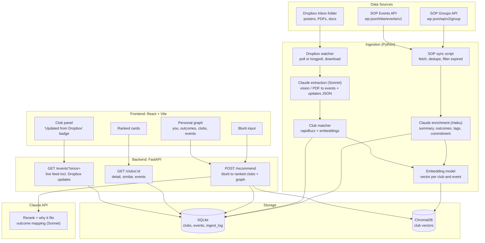

# Campus Compass (working title): a StudentOS for Clubs

> Rename freely. "StudentOS" is Dropbox's term for this challenge, so the working title stays distinct.

## The Problem

- U of T's Student Organization Portal (SOP) lists ~1,250 groups but only keyword search plus 17 broad interest categories. Nothing matches a student to a club by *what they want*.
- Events are the sparse, stale part. As of Sep 19, 2026 the SOP events API returned **9 upcoming events** across all groups. Real event info lives on Instagram posters, PDFs and word-of-mouth.
- Club fair is hectic; students find clubs through friends, not through the system.
- Club execs already have files (posters, schedules, exec lists), but nobody turns them into structured, findable info.

## The Idea

A campus graph that (1) **matches students to clubs by goals**, shows the result as a **personal Obsidian-style roadmap**, and (2) **stays fresh automatically**: clubs drop files (posters, PDFs) into a shared **Dropbox** folder and Claude turns them into live events and listing updates.

**One-line pitch:** *"Tell us what you want out of university. We'll map the clubs, the people and the next event to show up to, and it updates itself when a club drops a poster in Dropbox."*

## How It Maps to the Dropbox Challenge

| Dropbox prompt | Our answer |
|---|---|
| "Build a StudentOS ... connecting students, clubs, events, and goals" | Personal graph: you, goals, clubs, events |
| "Turn files into action" | Poster / PDF dropped in Dropbox becomes a published event |
| "Turn digital chaos into something useful" | Messy posters and inconsistent listings become structured, searchable data |
| "Relationship graphs / self-organizing content" | Graph edges come from AI-generated outcome tags |

---

## Scope for a 24h Hackathon

The demo is **three flows that work flawlessly**. Everything else is roadmap.

### Must have
1. **SOP sync**: pull all groups + events from SOP's public JSON APIs, dedupe, filter expired listings (see Data Sourcing)
2. **AI enrichment**: Claude turns each group's raw description into a summary, 1-3 outcomes, tags, commitment level
3. **Match flow**: student types a free-text blurb, gets 5-8 ranked clubs, each with a "why this fits you" line
4. **Personal graph view**: You, outcomes, clubs, next events (interactive, click for detail panel)
5. **Dropbox drop-to-update**: drop a poster or PDF in a shared folder, Claude extracts event details, it appears in the app with a "from Dropbox" badge, with provenance link to the source file

### Should have (pick ONE, hour 14 decision)
- Review queue for low-confidence extractions (approve / edit / reject)
- "Similar clubs" on each club page
- Save the student's personalized plan back to *their* Dropbox as a markdown/PDF (about 30 min with `files_upload`)

### Won't have (roadmap only)
- Instagram / Discord / LinkedIn scraping
- Accounts / auth, notifications, mobile app
- Courses, professors, research labs as graph nodes (the real StudentOS vision; mention in pitch)
- Multi-campus polish

---

## Data Sourcing (this got much easier)

SOP is a WordPress site with public REST endpoints. **Verified working on Sep 19, 2026:**

| Data | Endpoint | Notes |
|---|---|---|
| Groups | `https://sop.utoronto.ca/wp-json/wp/v2/group?per_page=100&page=N` | Title, description (HTML), link, campus, interest areas, group type, listing expiry (`acf._expiration-date`) |
| Events | `https://sop.utoronto.ca/wp-json/tribe/events/v1/events?per_page=50` | Title, description, start/end, venue + address, organizer name, cost, URL. Follow `next_rest_url` for pages |

**Data quirks to handle:**
- **Duplicates:** yearly re-listings show up as slugs starting `copy-of-`, with a `_oasis_original` meta ID pointing at the original. Dedupe on that, then on normalized title + campus. (Claude can do a fuzzy-match pass on the leftovers.)
- **Thin descriptions:** some groups have only one sentence. Enrichment must say "limited info" rather than invent details.
- **Expired listings:** filter on `_expiration-date` (stale detection for free).
- **Not in the group API:** social links and contact info. Check a few group HTML pages to see if they're worth parsing; otherwise skip.
- **Privacy:** event organizer records include students' personal emails. **Do not display them.**

**Etiquette:** run the sync once as a script, cache to disk/DB, throttle requests, set a clear User-Agent. Never hit SOP on every user request. Read SOP's terms before publishing anything publicly.

**Demo scope:** filter to the campus you pick (St George recommended) and recognized groups. Pilot enrichment on ~100 groups first, then run the rest with async concurrency.

---

## The Three Core Flows

### 1. Match (search / recommend)
1. Student types: *"First-year CS, want internships and friends, not too intense"*
2. Backend embeds the text and pulls the top ~20 clubs from the vector store
3. Claude (Sonnet) reranks to 5-8, maps the blurb to outcomes, and writes a one-line *why this fits* per club
4. Frontend renders cards and the graph

### 2. Personal graph
```
            [ You ]
        /      |      \
 [Career]  [Friends]  [Skills]      <- outcomes (fixed list, from the blurb)
    |   \      |      /   |
 [Club A]  [Club B]  [Club C]       <- ranked matches
    |         |          |
[Event: Tue 6pm] [Event: Fri]  ...  <- next step
```
- **Fixed outcome list** (~8) keeps the graph legible: *Make friends, Build skills/portfolio, Career and networking, Leadership, Give back, Culture and identity, Wellness and recreation, Academic/research.* Claude tags each club with 1-3 during enrichment.
- Never draw all 1,250 clubs (hairball). The graph is always **personal and small** (about 15-25 nodes).
- Click a club node: side panel with summary, why it matches, links, upcoming events.

### 3. Dropbox drop-to-update (the demo moment)
1. Shared folder `/CampusCompass/Inbox/` (optionally subfolders per club)
2. Backend watcher detects a new or changed file
3. Downloads it and sends to Claude (vision for images, native PDF input, plain text for docs)
4. Claude returns structured JSON (events, club updates, confidence)
5. Matched to a club, written to DB, embedded, and the frontend updates live
6. Card shows **"Updated from Dropbox: poster.png"** with a link to the source file

---

## Tech Stack

| Layer | Choice | Why |
|---|---|---|
| Frontend | **React + Vite + Tailwind + shadcn/ui** | Fast, looks good quickly |
| Graph UI | **react-force-graph-2d** (Obsidian look) or **React Flow / @xyflow/react** (more controlled layout) | Pick one in hour 1. Force graph for the vibe, React Flow if layout gets messy |
| Backend | **Python + FastAPI** (+ background asyncio task for the watcher) | Async, quick, auto docs |
| LLM | **Claude API**: Haiku for bulk enrichment, Sonnet for rerank/why and file extraction | Structured output via tool use / JSON schema; vision + PDF support for posters |
| Embeddings | **sentence-transformers (`all-MiniLM-L6-v2`)** local, or Voyage AI | Claude has no embeddings API; local = no extra key, works offline |
| Vector store | **ChromaDB** (embedded) | Zero setup; ~1,250 rows is tiny |
| Database | **SQLite** via SQLModel | Zero setup. Supabase only if you want hosted Postgres |
| Dropbox | **`dropbox` Python SDK** (API v2): `files_list_folder` + cursor, `files_list_folder_longpoll` or plain polling every ~5s, `files_download`, `sharing_create_shared_link_settings` | Polling avoids needing a public webhook URL |
| Fuzzy matching | **rapidfuzz** | Match "club name on poster" to DB entries |
| Deploy | **Vercel** (frontend) + **Railway / Fly.io** (backend) | See warning below |
| Collab | GitHub, `.env.example`, one owner per folder | Avoid merge pain at hour 20 |

**Deploy warning:** free hosting tiers often sleep, which kills the Dropbox watcher. Use a host that stays awake, or run the backend locally for the live demo and keep the deployed URL as backup.

**Dropbox setup notes (confirm against current Dropbox docs):**
- Create the app in the Dropbox App Console; scoped access with `files.metadata.read` and `files.content.read` (+ `files.content.write` if saving plans, `sharing.write` for shared links).
- Dropbox now issues **short-lived access tokens**. Use the **refresh-token (offline access) flow** so the token doesn't expire mid-demo.
- Do this in hour 0-1, not hour 12.

---

## Architecture



**Two pipelines, one database.** The SOP sync is a one-time bulk load; the Dropbox watcher is the continuous update loop. Both write the same tables, which is why the "source" field matters.

---

## Data Model

```
Club
  id, sop_id, sop_original_id      -- dedupe key
  name, campus, sop_interest_areas[]
  description_raw, summary         -- summary AI-written, "limited info" if thin
  outcomes[]                       -- 1-3 from the fixed list
  tags[]                           -- 5-8 lowercase
  commitment                       -- casual | moderate | intense | unknown
  meeting_info, links{}, sop_url
  listing_expires, last_updated, source  -- sop | dropbox

Event
  id, club_id, title, start, end, location, description, rsvp_url
  source                           -- sop | dropbox
  source_file, dropbox_link        -- provenance
  status                           -- published | pending_review
  confidence                       -- 0-1

IngestLog
  dropbox_file_id, rev/content_hash, status, result_json, timestamp
  -- prevents reprocessing the same file
```

## Claude Prompts (shape)

**Enrichment (per club, tool-use / JSON schema):**
> Given this student club's name and description, return: a 2-sentence neutral summary, 1-3 outcomes from [fixed list], 5-8 lowercase tags, commitment level (or "unknown"). Use ONLY the given text. If a field can't be determined, return null. Do not invent details.

**File extraction (per Dropbox file):**
> Today is {date}, timezone America/Toronto. This file was dropped by a student club. Return: `doc_type` (poster | schedule | roster | other), `club_name_guess`, `events[]` (title, start, end, location, description, rsvp_url), `club_updates` (meeting_info, links), `confidence` (0-1), `uncertainties[]`. Only extract what is visibly stated. If the date or year is ambiguous, list it under `uncertainties` instead of guessing.

**Safety rule:** auto-publish only if title + start date are present *and* confidence is high; otherwise `pending_review`. **Wrong dates in a live demo are the #1 way this fails.**

---

## 24-Hour Timeline (2-4 people)

| Hours | Task | Owner idea |
|---|---|---|
| 0-1 | Lock scope, repo, API keys, **create Dropbox app + refresh token**, confirm SOP endpoints, decide campus | Everyone |
| 0-1 | Ask 5 students how they found clubs; note quotes for the pitch | One person |
| 1-4 | SOP sync + dedupe into SQLite | A (data) |
| 1-4 | FastAPI skeleton; Dropbox: list folder + download a file | B / D |
| 1-4 | React skeleton, card component, static graph with mock data | C |
| 4-8 | Enrichment run (pilot 100, then all) + embeddings to Chroma | A |
| 4-8 | `/recommend` (vector, then rerank + why) | B |
| 4-8 | Dropbox watcher running, processing images/PDFs to JSON | D |
| 8-12 | Graph wired to real `/recommend` output; club detail panel | C |
| 8-12 | Extraction to club matching to Event rows; provenance links | D |
| 12-16 | Dropbox end-to-end: drop poster, event appears live in UI | D + C |
| 14 | **Decision point: pick ONE stretch feature** | Everyone |
| 16-18 | Integration, bug bash, deploy | B |
| **18** | **FEATURE FREEZE** | |
| 18-22 | Polish, loading/empty/error states, seed demo folder, clean data for demo clubs | C + A |
| 22-24 | Demo script, slides, rehearse 3x, **record backup video** | Everyone |

---

## Demo Script (2-3 min)

1. **Problem (20s):** "SOP has about 1,250 groups and 9 upcoming events. Everything else lives on Instagram posters."
2. **Match (40s):** Type a messy blurb, watch the personal graph appear. Click a club: why it fits, next event.
3. **The Dropbox moment (60s):** Drop a real poster into the shared folder. Within about 10 seconds a new event node appears with "Updated from Dropbox." Click through to the source file.
4. **How it works (20s):** Architecture slide: two pipelines, one graph.
5. **Roadmap (20s):** Courses, professors, labs as nodes (full StudentOS); more campuses; club-side dashboard.

Pre-stage 3 blurbs and 2 posters you *know* work. Test on the deployed URL. Never improvise the first search on stage.

---

## Risks and Mitigations

| Risk | Mitigation |
|---|---|
| Poster extraction gets dates wrong | Pass today's date; `uncertainties` field; `pending_review` for low confidence; show source file on every card |
| Dropbox token expires mid-demo | Refresh-token flow; test 1 hour before demo |
| Watcher dies on sleeping host | Always-on host or run locally; keep backup video |
| Graph becomes a hairball | Personal graph only, capped at ~25 nodes, fixed outcome list |
| Thin SOP descriptions produce weak tags | "Limited info" state; demo with clubs you've hand-checked |
| Duplicates confuse results | Dedupe on `_oasis_original` + normalized name before enrichment |
| Personal emails exposed | Never render organizer emails |
| SOP terms / rate limits | One-time cached sync, throttled, read terms before public launch |
| Scope creep (4 ideas, 24 hours) | Freeze at hour 18; stretch is pick ONE |
| Demo wifi fails | Local run + cached responses + recorded video |

---

## Open Questions

- Which campus for the demo? (St George recommended; check that its groups have decent descriptions)
- Team size and who owns Dropbox?
- Does the Dropbox track have specific judging criteria or API credits? Check the sponsor table early.
- Is SOP okay with this use? A quick note to them could even turn into "partner" language in the pitch.
- Validate first: what did the 5 students say?

## Roadmap (pitch material)

- Club exec dashboard: see what Claude extracted from your files, edit, approve
- Courses, professors, research labs, and career events as graph nodes (the full StudentOS)
- Weekly personalized digest: "3 events this week that match you"
- "Club health score" from last-updated date and activity
- Multi-campus, multi-school (the sync layer is school-agnostic for any WordPress/Tribe-based portal)
